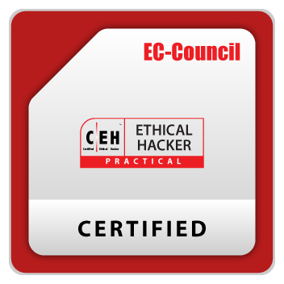
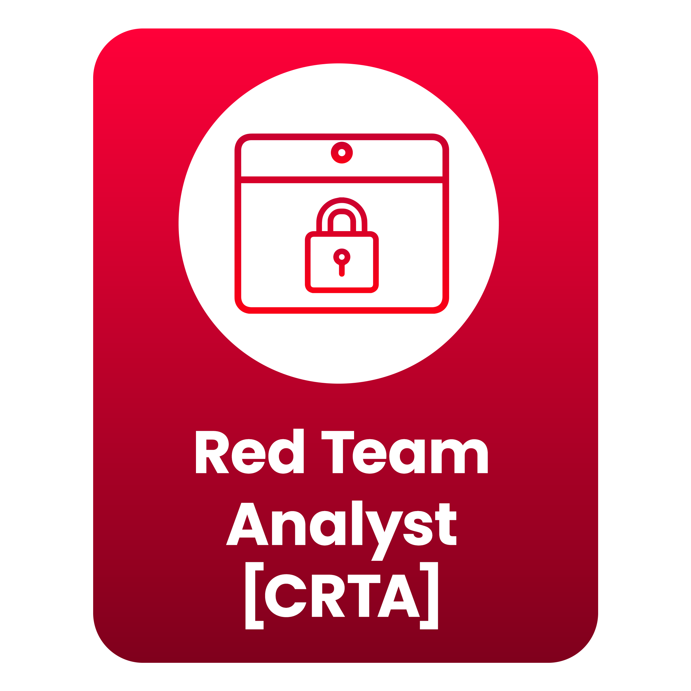

<!-- Banner / Wallpaper -->

  

<h1 align="center">Salam, I'm Hamza Sakhi </h1>

  

---

## 🏆 Certifications

  
  
  
  

---

## 💼 Connect with Me

  
  
  

---

## 🛠 Languages & Tools

  
  
  
  
  
  
  
  

---

## 📊 GitHub Stats

  

---

## 📫 Contact

  Reach me at: <a href="mailto:contact@hamzasakhi.com">contact@hamzasakhi.com</a>

